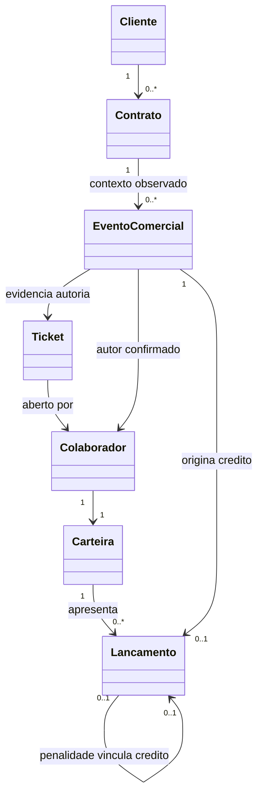
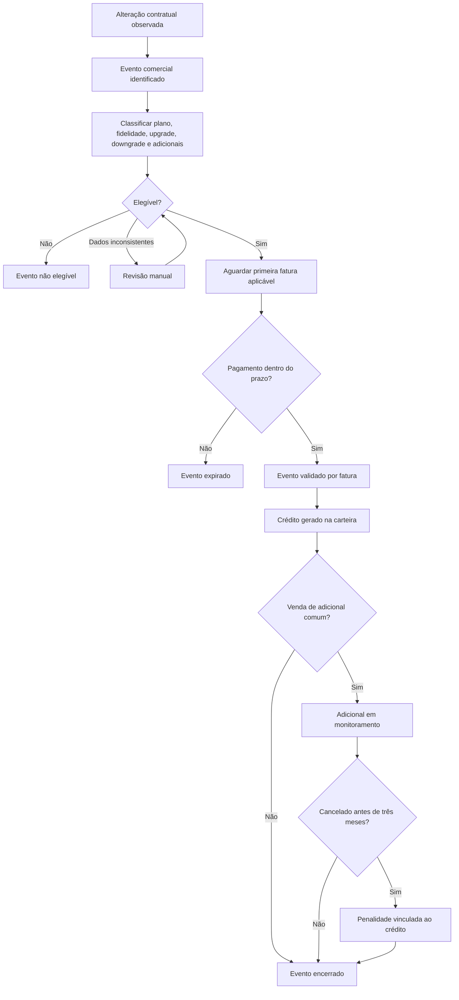

# Modelo de domínio — Upgrades e remuneração

Este documento deriva exclusivamente da especificação funcional
[Upgrades e remuneração](../regras_negocio/upgrades_e_remuneracao.md). Ele descreve
o modelo conceitual do domínio, sem definir armazenamento, interfaces ou
implementação.

## 1. Objetivo do modelo

Representar os conceitos, responsabilidades, limites e acontecimentos necessários
para identificar eventos comerciais de upgrades, alterações de plano, Mesh e
adicionais; avaliar sua elegibilidade; validá-los por fatura; e refletir créditos
e penalidades na carteira do colaborador com rastreabilidade.

Este domínio pertence ao Motor de Regras. Ele recebe informações já importadas,
normalizadas e relacionadas. Não importa dados, não normaliza registros e não
executa alterações nos sistemas de origem.

## 2. Linguagem ubíqua

| Termo | Significado no domínio |
|---|---|
| Alteração contratual | Mudança registrada no contrato. Pode ser comercial, administrativa ou uma correção e não implica remuneração. |
| Evento comercial | Ocorrência individual de venda ou upgrade avaliada de forma independente para remuneração. |
| Alteração de plano | Mudança de velocidade, modalidade comercial ou situação do Mesh. Sempre renova fidelidade. |
| Upgrade | Evento cujo valor mensal final é maior que o inicial. É uma classificação independente da alteração de plano. |
| Downgrade | Redução de plano, remoção de serviço ou redução do valor recorrente. Não gera crédito. |
| Plano | Combinação de velocidade e modalidade comercial. Planos padrão e promocionais de mesma velocidade são distintos. |
| Adicional comum | Produto que não altera o plano, como IP Público, Watch TV ou Câmeras. |
| Mesh | Exceção comercial tratada como plano, embora seja equipamento ou adicional físico. Não é adicional comum. |
| Autor da venda | Colaborador do suporte que efetivamente realizou a venda, identificado principalmente pela abertura do ticket. |
| Executor administrativo | Operador que efetiva tecnicamente a alteração. Não é presumido como autor da venda. |
| Ticket elegível | Ticket relacionado ao evento e aberto por colaborador do suporte. |
| Primeira fatura aplicável | Primeira fatura que contém o novo valor ou produto do evento comercial. |
| Validação por fatura | Comprovação de que a primeira fatura aplicável foi paga dentro do prazo. |
| Crédito | Lançamento positivo originado por evento comercial validado. |
| Débito | Lançamento negativo, como a penalidade por cancelamento precoce. |
| Penalidade | Débito de duas vezes o crédito original quando um adicional creditado é cancelado antes de três meses da venda. |
| Carteira | Extrato auditável dos lançamentos positivos e negativos de um colaborador. |
| Saldo | Resultado derivado da soma dos créditos menos a soma dos débitos. |
| Possível duplicidade | Existência de mais de um ticket ou possível autor para o mesmo cliente e alteração, exigindo revisão manual. |
| Monitoramento | Acompanhamento do adicional creditado até completar três meses desde a venda. |
| Expiração | Encerramento sem remuneração quando a primeira fatura aplicável não é paga no prazo de 35 dias após o vencimento. |

## 3. Entidades do domínio

### 3.1 Evento Comercial

**Responsabilidade:** representar uma venda ou upgrade individual; conservar sua
origem contratual, autoria, ticket, classificações, evidências financeiras,
estado e resultado de remuneração. Eventos sucessivos do mesmo contrato continuam
independentes.

**Identidade:** identidade própria do evento comercial. Ela deve permitir
distinguir alterações sucessivas e impedir crédito duplicado, mesmo quando os
eventos compartilham cliente, contrato ou evidência financeira.

**Ciclo de vida:** nasce como identificado; pode tornar-se não elegível,
aguardar pagamento, seguir para revisão manual, ser validado, pago, monitorado,
expirado, encerrado, marcado como inconsistente ou resultar em penalidade. As
transições completas ainda são uma pergunta aberta da especificação.

### 3.2 Colaborador

**Responsabilidade:** representar a pessoa que pode ser autora da venda e titular
da carteira. Sua vinculação ao suporte participa da elegibilidade.

**Identidade:** identificador do colaborador na fonte oficial.

**Ciclo de vida:** existe independentemente do evento comercial. Pode abrir
tickets, ser confirmado como autor e receber lançamentos. Mudanças de equipe ou
desligamento durante o ciclo ainda não possuem regra definida.

### 3.3 Cliente

**Responsabilidade:** identificar o cliente ao qual pertencem contrato, ticket e
evento comercial, bem como as referências externas observadas pelo evento.

**Identidade:** identificador do cliente na fonte oficial.

**Ciclo de vida:** existe independentemente deste domínio e pode possuir vários
contratos e eventos ao longo do tempo.

### 3.4 Contrato

**Responsabilidade:** representar o vínculo comercial cujo plano, Mesh,
adicionais, valor recorrente e fidelidade sofrem alterações.

**Identidade:** identificador do contrato na fonte oficial.

**Ciclo de vida:** precede os eventos e acumula sucessivas alterações. O domínio
observa seu histórico, mas não executa mudanças nele.

### 3.5 Ticket

**Responsabilidade:** fornecer a principal evidência de autoria e elegibilidade,
vinculando a ação comercial ao colaborador que o abriu, ao cliente, ao contrato e
à alteração.

**Identidade:** protocolo do ticket.

**Ciclo de vida:** é aberto antes da conclusão da autoria e permanece como
evidência do evento. Múltiplos tickets concorrentes podem provocar revisão
manual.

### 3.6 Carteira do Colaborador

**Responsabilidade:** oferecer o extrato auditável de créditos e débitos do
colaborador e apresentar saldo derivado desses lançamentos.

**Identidade:** o colaborador titular identifica sua carteira comercial.

**Ciclo de vida:** acompanha o colaborador e recebe lançamentos ao longo do tempo.
Seu saldo nunca tem ciclo independente: ele é sempre recalculado a partir do
extrato.

### 3.7 Lançamento da Carteira

**Responsabilidade:** registrar um crédito ou débito com valor, data,
justificativa, estado e vínculos de rastreabilidade. Um crédito aponta para o
evento e para a evidência financeira aplicável; uma penalidade também aponta
para o crédito original.

**Identidade:** identidade própria do lançamento, necessária para distinguir
créditos e débitos e impedir repetição do mesmo resultado financeiro.

**Ciclo de vida:** nasce a partir de um evento validado ou de uma penalidade
gerada; registra seu estado até a efetivação ou encerramento. A distinção exata
entre lançamento criado e valor efetivamente pago permanece em aberto.

## 4. Value Objects

Value Objects não possuem identidade própria; são definidos pelo conjunto de
seus valores.

### Plano

Combina velocidade e modalidade comercial. A igualdade exige ambos os valores;
500 Mbps padrão e 500 Mbps promocional não são o mesmo plano.

### Modalidade Comercial

Representa a modalidade padrão ou promocional usada para distinguir planos de
mesma velocidade.

### Valor Monetário

Representa valores recorrentes, valores de créditos, débitos e saldo. Comparações
entre os valores mensais inicial e final participam da classificação de upgrade
e redução recorrente.

### Composição Contratual

Retrata, em um instante, plano, situação do Mesh, adicionais comuns e valor
mensal. A comparação entre as composições inicial e final fundamenta a
classificação do evento sem substituir o contrato.

### Classificação do Evento

Conjunto de conclusões independentes sobre alteração de plano, renovação de
fidelidade, upgrade, downgrade e inclusão ou remoção de adicional comum. Não deve
ser reduzido a uma única categoria, pois algumas conclusões podem coexistir.

### Período de Validação

Representa o vencimento da primeira fatura aplicável e o limite de 35 dias para
pagamento. A forma exata de contagem ainda está pendente.

### Período de Monitoramento

Representa o intervalo de três meses contado da venda do adicional. Sua unidade
exata de contagem ainda está pendente.

### Estado do Evento Comercial

Representa um dos estados funcionais aprovados: identificado, não elegível,
aguardando pagamento, pendente de revisão manual, validado para pagamento, pago,
expirado, adicional em monitoramento, encerrado, penalidade gerada ou
inconsistente.

### Tipo de Lançamento

Distingue crédito de débito. O saldo não é um terceiro tipo: é resultado dos
lançamentos.

### Referências externas observadas

#### Alteração Contratual

Não é entidade deste domínio porque não possui comportamento próprio nem protege
invariantes de upgrades e remuneração. Representa apenas o estado observado do
contrato e a mudança entre as composições inicial e final usadas para identificar
e classificar um Evento Comercial.

Sua identificação na fonte oficial pode ser preservada para rastreabilidade, mas
o domínio não controla seu ciclo de vida. Os valores necessários à classificação
são expressos pela Composição Contratual.

#### Evidência Financeira da Fatura

A Fatura não é entidade deste domínio. Seu ciclo de vida pertence à fonte
financeira oficial e não é controlado pelo domínio de upgrades e remuneração.

O domínio utiliza somente uma evidência financeira da primeira fatura aplicável:
sua identificação para rastreabilidade, vencimento, composição relevante e
comprovação de pagamento. Essa evidência valida cada Evento Comercial
individualmente. Uma mesma fatura pode fornecer evidência para vários eventos
sem reuni-los ou duplicar créditos.

## 5. Agregados

### Agregado Evento Comercial

**Raiz:** Evento Comercial.

Protege a consistência da classificação, elegibilidade, autoria, validação,
estado e resultado daquele evento individual. Mantém referências ao cliente,
contrato, ticket e colaborador, além dos estados contratuais observados e da
evidência financeira necessária. Não assume o ciclo de vida das referências
externas.

O limite por evento preserva a regra de que vendas sucessivas são avaliadas
separadamente, inclusive quando uma única evidência financeira valida várias
delas.

### Agregado Carteira do Colaborador

**Raiz:** Carteira do Colaborador.

Define o titular e a visão auditável do extrato. Cada Lançamento da Carteira
mantém sua própria identidade e rastreabilidade. Conceitualmente, a carteira
consolida os lançamentos para derivar o saldo, mas não transforma o saldo em
verdade independente.

Para evitar um agregado ilimitado, a consistência de cada crédito ou débito deve
ser protegida no respectivo lançamento e em seu vínculo com o evento de origem.
O modelo conceitual não determina mecanismo de coordenação ou armazenamento.

### Visão simplificada dos agregados

```text
EventoComercial
├── origem contratual observada
├── composições inicial e final
├── classificação
├── autoria e ticket elegível
├── evidência financeira de validação
└── estado e resultado de remuneração

Carteira
└── Lançamentos
    ├── créditos
    └── débitos vinculados
        ↓
    Saldo derivado
```

## 6. Eventos de domínio

Eventos de domínio expressam fatos já ocorridos; não são comandos nem estados.

| Evento | Fato representado |
|---|---|
| `EventoComercialIdentificado` | Uma alteração originou um evento comercial individual a ser avaliado. |
| `EventoClassificado` | Foram registradas as conclusões de alteração de plano, fidelidade, upgrade, downgrade e adicionais. |
| `EventoConsideradoNaoElegivel` | O evento não atende às condições de remuneração. |
| `RevisaoManualSolicitada` | Duplicidade de autoria ou inconsistência impede decisão automática segura. |
| `AutoriaConfirmada` | A revisão ou evidência disponível confirmou o colaborador que realizou a venda. |
| `EventoValidadoPorFatura` | A primeira fatura aplicável comprovou o novo valor ou produto e foi paga no prazo. |
| `EventoExpirado` | O prazo de validação terminou sem pagamento válido. |
| `CreditoGerado` | Um evento elegível e validado originou lançamento positivo. |
| `AdicionalColocadoEmMonitoramento` | Um adicional creditado passou a ser acompanhado até três meses da venda. |
| `AdicionalCanceladoAntesDaValidacao` | O adicional foi removido antes da primeira fatura aplicável e não gera crédito. |
| `AdicionalCanceladoPrecocemente` | Um adicional já creditado foi removido antes de três meses da venda. |
| `PenalidadeGerada` | O cancelamento precoce originou débito de duas vezes o crédito original. |
| `RemuneracaoPaga` | O valor devido ao colaborador foi efetivamente pago. |
| `EventoEncerrado` | O evento concluiu seu ciclo sem pendências de pagamento ou monitoramento. |

## 7. Relacionamentos

- Um Cliente pode possuir vários Contratos.
- Um Contrato pode apresentar várias mudanças observadas e vários Eventos
  Comerciais ao longo do tempo.
- Os estados observados do Contrato fornecem as composições inicial e final usadas
  para identificar e classificar um Evento Comercial.
- Cada Evento Comercial mantém uma única identidade, mesmo quando compartilha
  origem contratual, contrato ou evidência financeira com outros eventos.
- Um Evento Comercial deve relacionar-se a ticket elegível para gerar crédito.
- Um Ticket identifica seu operador de abertura; esse operador é a principal
  evidência de autoria, mas uma possível duplicidade exige revisão.
- Um Colaborador pode ser autor de vários Eventos Comerciais e é titular de uma
  Carteira.
- Uma evidência financeira da mesma fatura pode validar vários Eventos
  Comerciais.
- Um Evento Comercial não pode ser validado duas vezes nem receber crédito
  duplicado.
- Um Evento Comercial validado pode originar um Crédito.
- Uma Carteira reúne a visão dos Lançamentos atribuídos ao seu titular.
- Uma Penalidade é um Lançamento de débito e deve referenciar o Crédito original.



O diagrama mostra relações conceituais, não estrutura de armazenamento.

## 8. Invariantes

1. Toda alteração de plano renova fidelidade.
2. Adicional comum não renova fidelidade.
3. Mesh é tratado como plano e não como adicional comum.
4. Alteração de plano e upgrade são conclusões independentes.
5. Downgrade não gera crédito, mesmo acompanhado por adicional comum.
6. Toda remuneração exige ticket elegível aberto por colaborador do suporte.
7. O executor administrativo não é presumido como autor da venda.
8. Toda remuneração exige a primeira fatura aplicável paga dentro do prazo.
9. Um Evento Comercial não pode receber crédito duplicado.
10. Uma Fatura pode validar vários Eventos Comerciais distintos.
11. Eventos comerciais permanecem individualizados quando compartilham fatura.
12. Adicional removido antes da primeira fatura aplicável não gera crédito.
13. Penalidade por cancelamento precoce é débito de duas vezes o crédito original.
14. Toda penalidade deve estar vinculada ao crédito original.
15. O período de monitoramento começa na data da venda do adicional.
16. Crédito de upgrade de plano é liberado após a primeira fatura aplicável paga.
17. Downgrade de plano permanece bloqueado até o pagamento das três primeiras
    faturas posteriores ao upgrade.
18. Alteração administrativa ou correção sem ticket do suporte não gera crédito.
19. Saldo da carteira é derivado exclusivamente dos lançamentos.
20. Toda decisão de autoria, elegibilidade, validação e penalidade deve preservar
    as evidências que a justificam.

## 9. Fluxo conceitual do domínio



Uma remoção ocorrida antes da primeira fatura aplicável encerra a venda do
adicional sem crédito. Uma fatura compartilhada percorre a validação de cada
evento separadamente.

## 10. Responsabilidades de cada entidade

| Entidade | Deve responder por | Não deve responder por |
|---|---|---|
| Evento Comercial | Identidade da venda, classificação, elegibilidade, autoria, estado, validação e rastreabilidade do próprio evento | Importação, normalização, saldo global da carteira ou execução da alteração contratual |
| Colaborador | Identidade do autor e titularidade da carteira | Inferir automaticamente mérito comercial a partir da execução administrativa |
| Cliente | Identidade do cliente relacionado | Classificar ou remunerar eventos |
| Contrato | Contextualizar plano, serviços, valor e fidelidade ao longo das alterações | Concentrar o ciclo de pagamento do colaborador |
| Ticket | Evidenciar abertura, operador e vínculo com a origem contratual observada | Resolver sozinho disputas de autoria |
| Carteira do Colaborador | Apresentar extrato e saldo derivado | Ser fonte independente do saldo ou decidir elegibilidade |
| Lançamento da Carteira | Registrar um crédito ou débito e seus vínculos | Reclassificar o evento comercial que o originou |

## 11. Limites do agregado

- Cliente, Contrato, Ticket e Colaborador possuem ciclos próprios e são apenas
  referenciados pelo Evento Comercial.
- O Agregado Evento Comercial não incorpora todo o histórico do contrato, a
  fatura completa nem o cadastro completo do colaborador. Conserva somente os
  estados contratuais observados e a evidência financeira necessários ao evento.
- Cada evento protege somente sua própria classificação, autoria, validação,
  estado e unicidade de crédito.
- Compartilhar evidência financeira de uma fatura não cria um agregado único para
  vários eventos.
- A Carteira não assume a responsabilidade de validar eventos; ela recebe a
  representação dos lançamentos já justificados.
- O saldo não é entidade nem raiz de agregado. É projeção derivada do extrato.
- A relação entre penalidade e crédito original não permite que o débito exista
  sem sua origem auditável.
- O modelo não define transações, consistência distribuída ou forma de guardar
  referências.

## 12. O que não pertence ao domínio

- banco de dados, tabelas, migrações ou consultas;
- APIs, endpoints, DTOs ou formatos de transporte;
- autenticação, autorização ou perfis de acesso;
- filas, mensageria ou mecanismos de entrega de eventos;
- scheduler, tarefas periódicas ou estratégia de monitoramento automático;
- conectores e integração com MK ou qualquer outro fornecedor;
- importação, sincronização e histórico técnico de importações;
- normalização e relacionamento técnico de dados;
- telas, dashboards e relatórios;
- detalhes de folha de pagamento, contabilidade ou tributação;
- mecanismos de revisão manual e sua interface;
- observabilidade, logs e infraestrutura;
- decisões de persistência ou consistência técnica.

Esses elementos podem servir ou consumir o domínio, mas não definem seus
conceitos nem suas regras.

## 13. Perguntas arquiteturais abertas

As perguntas abaixo refletem pontos ainda não definidos pela especificação; não
constituem decisões deste modelo:

1. Quais transições de estado são válidas e quem pode confirmá-las?
2. O que distingue, no ciclo de vida, crédito gerado, validado e efetivamente
   pago ao colaborador?
3. Qual critério identifica de forma inequívoca o mesmo evento comercial para
   impedir duplicidade?
4. Uma Alteração Contratual pode fundamentar mais de um evento comercial no mesmo
   instante e, em caso positivo, como se preserva a separação?
5. Quais critérios temporais e de conteúdo vinculam ticket e alteração?
6. Como a autoria é representada enquanto existem candidatos concorrentes e após
   uma revisão inconclusiva?
7. Qual é o limite exato entre o ciclo do Evento Comercial e o processo humano de
   revisão manual?
8. Como pagamentos parciais, renegociados, compensados, estornados ou tardios
   afetam a validação já registrada?
9. Como identificar a primeira fatura aplicável em ciclos proporcionais, mudança
   de vencimento ou faturamento agrupado?
10. O prazo de 35 dias inclui o vencimento e qual é seu instante final?
11. “Três meses” significa meses-calendário ou quantidade fixa de dias, e como
    tratar datas inexistentes no mês final?
12. Em venda combinada de plano e adicional, o adicional possui monitoramento e
    penalidade separados do crédito da mensalidade integral?
13. Como representar a classificação ainda pendente de um evento que reúne
    redução de velocidade e aumento do valor final, sem alterar a regra de que
    não há crédito?
14. A penalidade de cancelamento precoce alcança Mesh ou somente adicionais
    comuns?
15. Como tratar remoção parcial, troca ou múltiplas unidades de adicionais?
16. Como a carteira trata saldo negativo, mudança de período, desligamento ou
    mudança de equipe?
17. Como comprovar as três primeiras faturas necessárias para permitir downgrade
    após upgrade?
18. Qual fonte e vigência definem o catálogo de planos, valores e classificação
    de produtos futuros?
19. Como corrigir lançamento incorreto que já tenha sido pago?

## 14. Possíveis entidades futuras

Os conceitos abaixo podem exigir identidade e ciclo de vida próprios, mas as
regras atuais ainda não os fundamentam suficientemente como entidades:

### Revisão Manual

Pode vir a registrar solicitação, evidências, responsável, decisão e conclusão.
Hoje estão confirmados somente a necessidade de revisão e seu resultado esperado;
responsáveis, estados e evidências mínimas permanecem pendentes.

### Candidatura de Autoria

Pode representar cada possível autor ligado a tickets concorrentes. A
especificação confirma possíveis duplicidades, mas não define ciclo próprio,
critérios de comparação ou tratamento de revisão inconclusiva.

### Catálogo Comercial

Pode concentrar vigência de planos, preços e classificação de produtos. Os
valores atuais estão documentados, porém ainda não foi definido se constituem
catálogo fixo ou referências mantidas em fonte oficial.

### Validação Financeira

Pode tornar-se entidade se precisar registrar tentativas, estornos, pagamentos
parciais ou múltiplas evidências. No modelo atual, a validação permanece parte do
ciclo do Evento Comercial porque somente o vínculo com a primeira fatura paga
está confirmado.

## 15. Revisão crítica do modelo

### Entidades duplicadas

- Upgrade e Downgrade não foram modelados como entidades: são classificações do
  Evento Comercial. Isso evita duplicar identidade, autoria, ticket e validação.
- Crédito e Penalidade não foram transformados em entidades paralelas ao
  Lançamento da Carteira. São tipos e origens de lançamentos, preservando um único
  conceito financeiro auditável.
- Saldo não foi modelado como entidade nem valor armazenado; é sempre derivado.

### Responsabilidades misturadas

- Evento Comercial não executa alteração no Contrato nem assume o ciclo da fonte
  financeira, do Ticket ou do Colaborador.
- Carteira não classifica vendas e Evento Comercial não calcula o saldo global.
- A autoria comercial permanece separada da execução administrativa.
- Regras técnicas de importação e processamento ficaram fora do domínio.

### Regras nas entidades erradas

- A validação e a unicidade do crédito pertencem ao evento individual, não à
  evidência financeira compartilhada.
- O saldo pertence à visão da Carteira e deriva dos Lançamentos.
- A penalidade pertence ao extrato como débito vinculado, mas sua causa permanece
  rastreável ao Evento Comercial e ao crédito original.

### Tamanho dos agregados

- Evento Comercial referencia entidades externas ao seu limite, evitando agregar
  o contrato completo, a fonte financeira ou o histórico do colaborador.
- Carteira não deve carregar ou bloquear conceitualmente todo o histórico para
  alterar um lançamento. O limite exato de consistência será refinado somente
  quando houver requisitos técnicos, sem mudar a regra de saldo derivado.

### Risco de objetos anêmicos

O modelo atribui comportamento conceitual: Evento Comercial protege
classificação, elegibilidade, transições e unicidade do crédito; Lançamento
protege sinal, valor e vínculos; Carteira deriva saldo e apresenta extrato. O
documento não prescreve métodos porque não é um desenho de código, mas também não
reduz as entidades a recipientes de dados.

### Conclusão da revisão

O modelo mantém responsabilidades coesas e evita criar entidades para conceitos
ainda insuficientemente definidos. As principais incertezas estão isoladas como
perguntas arquiteturais ou possíveis entidades futuras, sem introduzir novas
regras.
