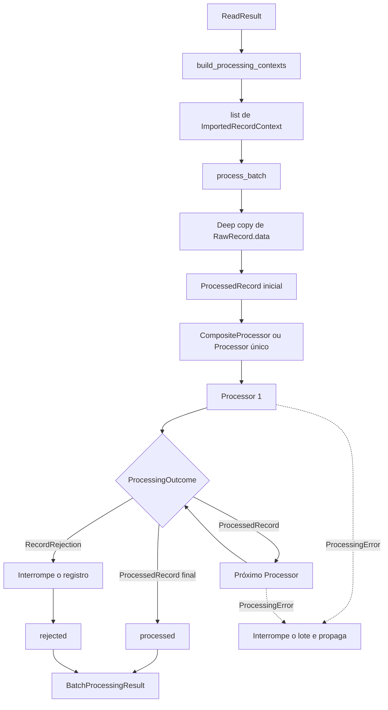

# Arquitetura do Processing Engine

## 1. Objetivo

O Processing Engine prepara tecnicamente registros importados para etapas
posteriores da plataforma. Ele normaliza estruturas, permite encadear
transformações técnicas e separa resultados válidos de rejeições esperadas.

O Processing Engine não interpreta regras da empresa. Cálculos de CSAT, RV,
upgrades, reincidência, extras, pagamentos e alertas pertencem ao Rules Engine.

Na arquitetura oficial, o Processing Engine está localizado depois do Banco
Operacional e antes do Rules Engine:

```text
Import Engine
    ↓
Banco Operacional
    ↓
Processing Engine
    ↓
Rules Engine
```

O fluxo em memória descrito neste documento começa em `ReadResult` porque a
persistência operacional ainda não foi implementada. Isso valida os contratos
do MVP, mas não elimina o Banco Operacional da arquitetura oficial.

## 2. Fluxo completo atual

```text
ReadResult
    ↓
build_processing_contexts
    ↓
list[ImportedRecordContext]
    ↓
process_batch
    ↓
ProcessedRecord inicial
    ↓
CompositeProcessor
    ↓
Processor 1 → Processor 2 → ... → Processor N
    ↓
BatchProcessingResult
```

O uso de `CompositeProcessor` é opcional. `process_batch` aceita qualquer
implementação estrutural de `Processor`, inclusive um processor único.

### 2.1 Sequência por registro

1. `build_processing_contexts` cria um contexto para cada `RawRecord`.
2. `process_batch` cria um `ProcessedRecord` inicial com `origin` apontando para
   o contexto e uma cópia profunda de `RawRecord.data`.
3. O processor recebe exclusivamente esse `ProcessedRecord`.
4. Um `CompositeProcessor` encaminha cada `ProcessedRecord` para a próxima
   etapa na ordem declarada.
5. O resultado final é um `ProcessedRecord` ou uma `RecordRejection`.
6. `process_batch` adiciona o resultado à coleção correspondente.

## 3. Diagrama da pipeline



## 4. Responsabilidades dos componentes

### 4.1 `build_processing_contexts`

Responsabilidades:

- adaptar `ReadResult` para contextos de processamento;
- criar exatamente um contexto por registro bruto;
- preservar a ordem dos registros;
- manter as mesmas instâncias de `RawRecord` e `SourceMetadata`;
- gerar um `trace_id` independente para cada contexto.

Responsabilidades proibidas:

- copiar ou normalizar o conteúdo bruto;
- executar processors;
- persistir dados;
- aplicar regras de negócio;
- alterar o `ReadResult` ou seus objetos internos.

### 4.2 `process_batch`

Responsabilidades:

- percorrer contextos sequencialmente;
- criar a fronteira homogênea do Processing Engine;
- construir um `ProcessedRecord` inicial por contexto;
- usar cópia profunda para isolar os dados brutos;
- executar um `Processor` por registro;
- separar processados e rejeitados;
- interromper imediatamente em caso de falha técnica.

Responsabilidades proibidas:

- escolher processors ou sua ordem;
- normalizar campos diretamente;
- capturar ou converter `ProcessingError`;
- continuar o lote após uma falha técnica;
- modificar `RawRecord.data`;
- aplicar regras de negócio ou persistir resultados.

### 4.3 `CompositeProcessor`

Responsabilidades:

- representar uma sequência ordenada e não vazia de processors;
- entregar a saída válida de uma etapa à etapa seguinte;
- interromper a cadeia ao receber uma rejeição;
- devolver o resultado final sem converter falhas técnicas.

Responsabilidades proibidas:

- receber `ImportedRecordContext` diretamente;
- adaptar ou copiar dados brutos;
- executar lotes;
- capturar `ProcessingError`;
- transformar rejeição em exceção;
- executar etapas posteriores depois de uma rejeição;
- reordenar processors.

Uma composição vazia é inválida e levanta `ValueError`. Ela não deve inventar
silenciosamente uma transformação identidade.

### 4.4 `Processor`

Responsabilidades:

- receber um `ProcessedRecord`;
- realizar uma transformação técnica coesa;
- produzir um novo `ProcessedRecord` ou uma `RecordRejection`;
- preservar a mesma origem durante o fluxo;
- lançar `ProcessingError` quando uma falha técnica impedir a execução.

Responsabilidades proibidas:

- receber ou consultar `ImportedRecordContext` como entrada operacional;
- ler `origin.raw_record.data` para decidir quais dados processar;
- modificar o registro recebido ou seus contêineres;
- modificar dados brutos;
- acessar banco, API ou sistema externo;
- persistir dados;
- aplicar regras específicas da empresa;
- capturar uma falha técnica apenas para convertê-la em rejeição esperada.

### 4.5 `TechnicalNormalizationProcessor`

Responsabilidades:

- delegar a normalização recursiva ao normalizador técnico;
- construir um novo `ProcessedRecord`;
- preservar `origin`;
- normalizar somente `record.data`.

Responsabilidades proibidas:

- acessar o registro bruto pela origem;
- conhecer formatos de arquivo ou fornecedores;
- inferir regras de negócio;
- persistir ou validar entidades do domínio.

### 4.6 `TechnicalValueNormalizer`

Responsabilidades:

- remover espaços externos de strings;
- transformar strings vazias após `strip` em `None`;
- reconstruir listas e dicionários recursivamente;
- preservar os demais valores válidos de `ProcessedValue`.

Responsabilidades proibidas:

- conhecer contexto, origem, lote ou rastreabilidade;
- alterar chaves de dicionários;
- interpretar significado de campos;
- executar validações ou cálculos de negócio.

## 5. Contratos públicos

A API pública está disponível em `supervisor_ai.processing_engine`:

- `BatchProcessingResult`;
- `CompositeProcessor`;
- `ImportedRecordContext`;
- `ProcessedRecord`;
- `ProcessedValue`;
- `ProcessingError`;
- `ProcessingOutcome`;
- `Processor`;
- `RecordRejection`;
- `TechnicalNormalizationProcessor`;
- `build_processing_contexts`;
- `process_batch`.

### 5.1 Contrato de `Processor`

```python
class Processor(Protocol):
    def process(self, record: ProcessedRecord) -> ProcessingOutcome:
        ...
```

`ProcessingOutcome` é definido como:

```python
ProcessedRecord | RecordRejection
```

Todos os processors usam a mesma entrada. O contexto importado é adaptado uma
única vez por `process_batch`.

### 5.2 `ProcessedValue`

O valor processado aceita recursivamente:

- `None`;
- `str`;
- `bool`;
- `int`;
- `float`;
- `Decimal`;
- `date`;
- `datetime`;
- `UUID`;
- listas desses valores;
- dicionários com chaves `str` e esses valores.

## 6. Objetos do modelo técnico

Esses objetos pertencem ao modelo técnico do motor. Eles não são entidades de
negócio como cliente, contrato, atendimento ou pagamento.

### 6.1 `ImportedRecordContext`

Agrupa:

- o mesmo `RawRecord` produzido pela importação;
- o mesmo `SourceMetadata` do `ReadResult`;
- um `trace_id` gerado para o fluxo atual.

O `trace_id` permite correlação em memória. Ele não é uma identidade persistente
definitiva nem substitui futura auditoria no banco.

### 6.2 `ProcessedRecord`

Representa o registro em trânsito dentro do Processing Engine.

- `origin`: contexto importado que fornece linhagem;
- `data`: representação técnica atual do registro;
- `metadata`: informações técnicas adicionais do processamento.

O primeiro `ProcessedRecord` é criado por `process_batch`. Os processors
seguintes devem criar novas instâncias e preservar `origin`.

### 6.3 `RecordRejection`

Representa uma impossibilidade esperada de processar um registro específico.

- mantém a origem do registro;
- possui código estável de motivo;
- possui mensagem técnica segura;
- pode conter metadados técnicos adicionais.

Uma rejeição não significa indisponibilidade do motor e não deve interromper os
demais registros do lote.

### 6.4 `BatchProcessingResult`

Contém duas coleções independentes:

- `processed`: registros processados com sucesso;
- `rejected`: rejeições esperadas.

A ordem é preservada dentro de cada coleção. Não existe uma ordem global
combinada entre processados e rejeitados.

## 7. Fluxo de `ProcessingError`

`ProcessingError` representa falha técnica, não rejeição de dados.

```text
Processor lança ProcessingError
    ↓
CompositeProcessor não captura
    ↓
process_batch não captura
    ↓
chamador recebe a mesma exceção
```

Consequências:

- o lote para imediatamente;
- contextos posteriores não são processados;
- nenhum `BatchProcessingResult` parcial é devolvido;
- resultados já criados permanecem apenas em memória e não são retornados;
- a exceção nunca é convertida em `RecordRejection`.

Processors não devem produzir efeitos externos. Assim, o comportamento
fail-fast não deixa persistências parciais sob responsabilidade do motor atual.

## 8. Fluxo de `RecordRejection`

```text
Processor devolve RecordRejection
    ↓
CompositeProcessor encerra a cadeia do registro
    ↓
process_batch adiciona em rejected
    ↓
próximo contexto continua normalmente
```

Uma rejeição:

- não executa processors posteriores para o mesmo registro;
- não interrompe o restante do lote;
- não deve ser usada para representar indisponibilidade, defeito de código ou
  erro inesperado de infraestrutura.

## 9. Invariantes arquiteturais

As condições abaixo devem permanecer verdadeiras:

1. O Import Engine nunca depende do Processing Engine.
2. `build_processing_contexts` não copia nem transforma registros.
3. `process_batch` é o único ponto que adapta contexto para registro processado.
4. Todo `Processor` recebe exclusivamente `ProcessedRecord`.
5. Nenhum processor lê dados operacionais a partir de `origin.raw_record.data`.
6. `RawRecord.data` nunca é modificado pelo processamento.
7. O registro inicial não compartilha listas ou dicionários com os dados brutos.
8. Toda etapa válida devolve um novo `ProcessedRecord` ou uma rejeição.
9. `origin` e seu `trace_id` são preservados durante toda a cadeia.
10. Uma rejeição impede a execução das etapas posteriores daquele registro.
11. Uma falha técnica interrompe imediatamente todo o lote.
12. `ProcessingError` nunca é convertido em rejeição.
13. `RecordRejection` nunca é usada para esconder defeitos técnicos.
14. `CompositeProcessor` nunca possui cadeia vazia.
15. A ordem declarada dos processors nunca é alterada.
16. O Processing Engine não contém regras de negócio.
17. O Processing Engine não acessa banco, API ou fornecedor externo.
18. Processors não produzem efeitos externos.

Atualmente, a preservação de `origin` é uma obrigação do contrato e não uma
validação automática do `CompositeProcessor`. Revisões devem verificar essa
invariante explicitamente.

## 10. Guia para novos processors

### 10.1 Estrutura mínima

```python
from supervisor_ai.processing_engine import ProcessedRecord, ProcessingOutcome


class ExampleProcessor:
    def process(self, record: ProcessedRecord) -> ProcessingOutcome:
        processed_data = {
            **record.data,
            # transformação técnica genérica
        }
        return ProcessedRecord(
            origin=record.origin,
            data=processed_data,
            metadata=dict(record.metadata),
        )
```

### 10.2 Regras de implementação

1. Receba somente `ProcessedRecord`.
2. Leia somente `record.data`, nunca os dados brutos por `origin`.
3. Não modifique `record` ou contêineres recebidos.
4. Crie uma nova estrutura para a saída.
5. Preserve exatamente `record.origin`.
6. Preserve ou altere metadados de forma explícita.
7. Retorne `RecordRejection` somente para condições esperadas do registro.
8. Lance `ProcessingError` para falhas técnicas que impedem a etapa.
9. Não capture exceções técnicas para transformá-las em rejeições.
10. Mantenha a transformação pequena, determinística e sem efeitos externos.
11. Não consulte banco, API, arquivo ou serviço externo.
12. Não implemente regra específica da empresa.

### 10.3 Testes mínimos de um processor

- entrada válida e saída esperada;
- ausência de mutação do registro recebido;
- preservação da mesma instância de `origin`;
- estruturas aninhadas relevantes;
- rejeições esperadas, quando existirem;
- propagação de falhas técnicas, quando aplicável;
- compatibilidade estrutural com `Processor`.

## 11. Checklist para Pull Requests

### Fronteiras

- [ ] A mudança pertence ao Processing Engine, e não ao Import ou Rules Engine?
- [ ] Nenhuma dependência reversa foi adicionada ao Import Engine?
- [ ] O código está organizado por responsabilidade técnica?
- [ ] Não foi adicionada persistência ou integração externa ao processor?

### Contratos

- [ ] O processor recebe apenas `ProcessedRecord`?
- [ ] O retorno é `ProcessedRecord` ou `RecordRejection`?
- [ ] A mesma instância de `origin` é preservada?
- [ ] O `trace_id` permanece acessível pela origem?
- [ ] A API pública foi alterada somente quando necessário e documentado?

### Dados e mutabilidade

- [ ] `RawRecord.data` permanece inalterado?
- [ ] O processor não consulta `origin.raw_record.data`?
- [ ] O registro de entrada e seus contêineres não são modificados?
- [ ] A saída utiliza novas estruturas mutáveis quando necessário?
- [ ] Estruturas aninhadas estão cobertas por testes?

### Rejeições e erros

- [ ] Rejeições representam apenas condições esperadas por registro?
- [ ] Processors posteriores deixam de executar após uma rejeição?
- [ ] `ProcessingError` é propagado sem conversão?
- [ ] Falhas técnicas interrompem o lote conforme a política atual?
- [ ] Nenhuma exceção sensível é exposta indevidamente?

### Escopo e qualidade

- [ ] Não existem regras de CSAT, RV, upgrades ou outros domínios no motor?
- [ ] A transformação é pequena, coesa e reutilizável?
- [ ] Não existem efeitos externos ou dependências novas sem justificativa?
- [ ] Testes unitários e de integração cobrem o fluxo alterado?
- [ ] Ruff, pytest e `git diff --check` foram executados?

## 12. Limitações atuais e evolução futura

- A rastreabilidade atual é baseada em referências em memória.
- `trace_id` não substitui identidade persistente ou histórico de auditoria.
- A execução é síncrona, sequencial e fail-fast para falhas técnicas.
- Não existe resultado parcial quando ocorre `ProcessingError`.
- A ordem global combinada de processados e rejeitados não é armazenada.
- A persistência operacional e consolidada será introduzida em entregas futuras,
  respeitando a arquitetura oficial.
- Relacionamentos que exijam acesso a múltiplos registros ainda não possuem um
  contrato específico e só devem ser introduzidos quando houver necessidade
  concreta.
