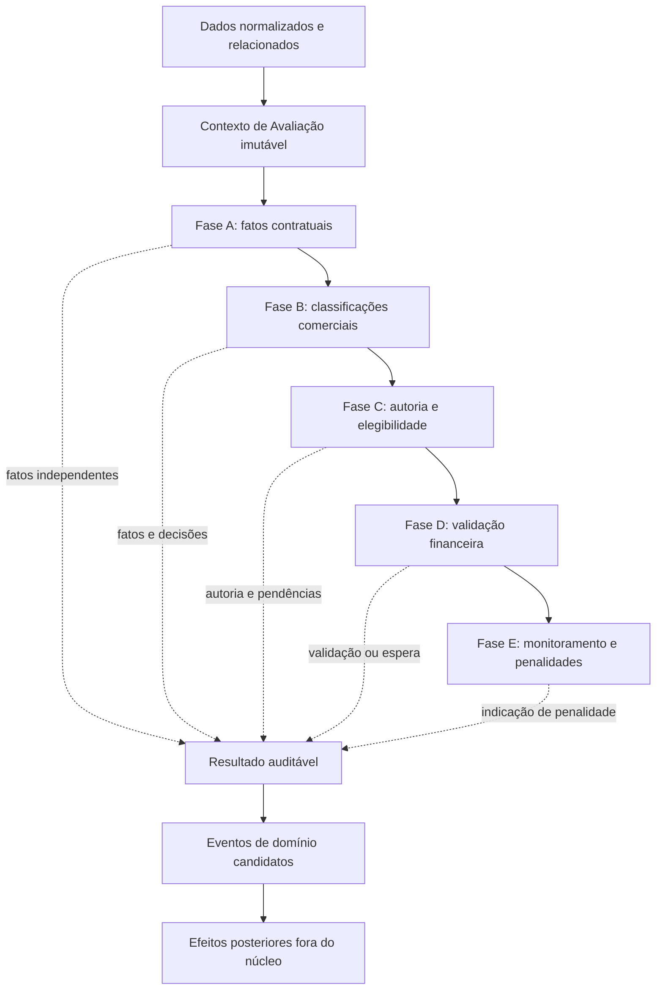

# Arquitetura conceitual do Rules Engine

Este documento define a arquitetura conceitual e lógica do Motor de Regras do
Supervisor AI. Ele deve ser lido em conjunto com:

- [Arquitetura lógica](arquitetura_logica.md);
- [Processing Engine](processing_engine.md);
- [Modelo de domínio de upgrades](modelo_de_dominio_upgrades.md);
- [Especificação de upgrades e remuneração](../regras_negocio/upgrades_e_remuneracao.md).

O documento usa Upgrades e Remuneração como primeiro domínio concreto para
validar a arquitetura. As regras descritas são somente as já aprovadas na
especificação funcional. Nenhuma estrutura de código ou tecnologia de execução é
definida aqui.

## 1. Objetivo do Rules Engine

O Rules Engine transforma informações tecnicamente normalizadas, relacionadas e
coerentes em fatos, classificações e decisões de negócio explicáveis.

Na arquitetura geral, ele está depois do Processing Engine e antes dos efeitos e
das visões consolidadas:

```text
Import Engine
    ↓
Banco Operacional
    ↓
Processing Engine
    ↓
Rules Engine
    ↓
Banco Consolidado e efeitos posteriores
```

Sua responsabilidade é interpretar o significado comercial dos dados. No
domínio de upgrades, isso inclui reconhecer alterações de plano, upgrade,
downgrade, fidelidade, adicionais, elegibilidade, validação financeira,
monitoramento e penalidades.

O motor não importa, normaliza nem persiste dados. Também não executa os efeitos
que suas conclusões podem motivar. Seu produto é uma avaliação auditável que
explicita o que foi observado, o que foi derivado, o que foi decidido e o que
permanece incerto.

## 2. Entradas do motor

O Rules Engine recebe conceitos de negócio já formados a partir de dados
normalizados e relacionados. A entrada deve representar um recorte consistente
da realidade necessária à avaliação, sem exigir consultas durante a execução.

### 2.1 Informações necessárias para classificar

- identificação do cliente e do contrato;
- contexto contratual anterior e posterior;
- plano, velocidade e modalidade comercial antes e depois;
- adicionais comuns antes e depois;
- situação do Mesh antes e depois;
- valores recorrentes inicial e final;
- data da alteração observada;
- indicação de alteração administrativa ou correção, quando conhecida.

Essas informações permitem produzir fatos contratuais e classificações. Elas não
bastam, sozinhas, para autorizar remuneração.

### 2.2 Informações necessárias para avaliar elegibilidade

- ticket relacionado;
- identificação e data de abertura do ticket;
- autoria candidata;
- área do autor na data relevante;
- vínculo entre ticket, cliente, contrato e alteração observada;
- executor administrativo, sem presumi-lo como autor;
- eventos ou tickets anteriores relacionados, quando necessários para detectar
  possível duplicidade;
- histórico disponível para apoiar revisão manual;
- classificação comercial já produzida.

### 2.3 Informações necessárias para validar pagamento

- primeira fatura aplicável, quando já identificada;
- vencimento da fatura;
- composição relevante que demonstra o novo valor ou produto;
- situação e data de pagamento;
- limite de 35 dias após o vencimento;
- identidade do evento avaliado;
- eventos anteriores que tenham utilizado a mesma evidência, quando necessários
  para evitar validação duplicada do mesmo evento.

Uma mesma evidência financeira pode validar vários eventos distintos. Ela não
pode validar duas vezes o mesmo evento.

### 2.4 Informações necessárias para monitorar penalidades

- adicional comum vendido;
- data da venda;
- existência e valor do crédito original;
- data de remoção, quando houver;
- vínculo entre remoção, evento de venda e crédito original;
- período de três meses contado da venda;
- estado atual do monitoramento.

O cálculo do saldo da carteira não é uma entrada nem uma responsabilidade do
motor de classificação. Somente o crédito original necessário para avaliar a
penalidade participa desse contexto.

### 2.5 Qualidade das entradas

As entradas devem manter:

- identidade e rastreabilidade até as fontes observadas;
- instante ou período de validade;
- distinção entre informação presente, ausente e conflitante;
- vínculo explícito entre dados de diferentes origens;
- conceitos de negócio, não linhas brutas de arquivo ou estruturas específicas
  de fornecedor.

## 3. Contexto de avaliação

O Contexto de Avaliação é o conjunto imutável de fatos de entrada observado em
determinado momento para avaliar um evento ou situação de negócio.

Imutável, aqui, significa que uma avaliação não altera o contexto recebido. Uma
nova informação, como o pagamento de uma fatura, produz um novo contexto para
nova avaliação; não modifica retroativamente o recorte anterior.

O contexto:

- reúne os conceitos necessários à avaliação pretendida;
- identifica o objeto e o instante da avaliação;
- preserva a origem das informações;
- pode referenciar resultados anteriores necessários à regra atual;
- não contém decisões produzidas pela própria execução.

O contexto não deve:

- tomar decisões;
- modificar seus dados ou os dados de origem;
- acessar banco de dados;
- buscar informações externas durante a avaliação;
- misturar dados técnicos brutos com conceitos de negócio;
- executar efeitos decorrentes do resultado.

### 3.1 Contexto incompleto

Falta informação necessária a uma conclusão específica. Isso não torna todas as
demais conclusões inválidas. Por exemplo, sem evidência financeira ainda pode ser
possível classificar alteração de plano, upgrade e downgrade.

### 3.2 Contexto inconsistente

Contém informações conflitantes que não podem ser simultaneamente aceitas para a
mesma conclusão, como dois valores finais incompatíveis para o mesmo instante. A
inconsistência deve ser registrada e não resolvida por escolha silenciosa.

### 3.3 Contexto suficiente

Contém todas as informações exigidas pelas regras aplicáveis à conclusão
pretendida. Suficiência é relativa: um contexto pode ser suficiente para
classificação contratual e insuficiente para validação financeira.

## 4. Regras independentes

A arquitetura favorece regras pequenas, determinísticas e sem efeitos externos.
Cada regra consome somente fatos necessários, produz novas conclusões e explica
sua contribuição. Uma regra não deve assumir responsabilidades de outra fase.

### 4.1 Regras contratuais e de classificação

| Regra conceitual | Responsabilidade | Informações consumidas | Proposições ou conclusões que pode produzir | O que não deve decidir |
|---|---|---|---|---|
| Alteração de plano | Reconhecer mudança de velocidade, modalidade ou situação do Mesh | Composições anterior e posterior | Velocidade alterada, modalidade alterada, Mesh incluído ou removido, alteração de plano | Elegibilidade, autoria, pagamento ou crédito |
| Renovação de fidelidade | Derivar fidelidade da alteração de plano | Fato de alteração de plano | Renovação de fidelidade | Se há upgrade ou remuneração |
| Upgrade por valor | Comparar valor recorrente final e inicial | Valores recorrentes | Valor aumentou e possível classificação de upgrade | Crédito quando existe downgrade ou outra restrição |
| Downgrade por velocidade | Reconhecer redução de velocidade | Velocidades anterior e posterior | Redução de velocidade e downgrade | Se o valor total também configura upgrade; essa coexistência segue pendente |
| Remoção de serviço | Reconhecer retirada de adicional comum ou Mesh | Composições anterior e posterior | Adicional removido, Mesh removido e downgrade | Penalidade sem conhecer crédito e prazo |
| Inclusão de adicional comum | Reconhecer produto comum acrescentado | Adicionais antes e depois | Adicional comum incluído e venda de adicional comum | Alteração de plano, fidelidade ou validação financeira |
| Regra especial do Mesh | Aplicar seu tratamento comercial como plano | Situação do Mesh e valores | Mesh incluído ou removido, alteração de plano, venda de Mesh, downgrade quando removido | Tratar Mesh como adicional comum |

### 4.2 Regras de autoria e elegibilidade

| Regra conceitual | Responsabilidade | Informações consumidas | Proposições ou conclusões que pode produzir | O que não deve decidir |
|---|---|---|---|---|
| Elegibilidade do ticket | Verificar existência e abertura pelo suporte | Ticket, operador e área na data relevante | Ticket existente, ticket aberto pelo suporte ou ticket inelegível | Autoria em disputa ou validação financeira |
| Autoria | Relacionar o evento ao autor candidato com base nas evidências disponíveis | Ticket, operador de abertura e vínculos do evento | Autoria candidata ou autoria confirmada | Escolher automaticamente entre candidatos conflitantes |
| Duplicidade | Detectar múltiplos tickets ou candidatos para a mesma alteração | Evento, cliente, contrato, alterações e tickets relacionados | Possível duplicidade e necessidade de revisão manual | Determinar quem efetivamente realizou a venda |
| Elegibilidade comercial | Combinar classificação e condições confirmadas de ticket e autoria | Fatos comerciais, de ticket, autoria e duplicidade | Evento elegível, não elegível ou pendente de revisão | Considerar pagamento como substituto da elegibilidade |

### 4.3 Regras financeiras

| Regra conceitual | Responsabilidade | Informações consumidas | Proposições ou conclusões que pode produzir | O que não deve decidir |
|---|---|---|---|---|
| Primeira fatura aplicável | Verificar se a evidência contém o novo valor ou produto do evento | Evento elegível e evidência financeira | Primeira fatura aplicável identificada | Controlar o ciclo completo da fatura |
| Validação pela primeira fatura | Confirmar pagamento da evidência aplicável dentro do prazo | Elegibilidade, vencimento, composição e pagamento | Fatura paga dentro do prazo e evento validado financeiramente | Tornar elegível evento originalmente inelegível |
| Expiração | Reconhecer término do prazo sem pagamento válido | Primeira fatura aplicável, vencimento, limite e pagamento | Prazo expirado e evento expirado | Presumir expiração apenas porque a evidência ainda não chegou |
| Indicação de crédito | Indicar o efeito remuneratório permitido pelas decisões anteriores | Classificação, elegibilidade e validação financeira | Crédito aplicável e base aprovada de remuneração | Criar lançamento, pagar colaborador ou calcular saldo |

### 4.4 Regras de monitoramento e penalidade

| Regra conceitual | Responsabilidade | Informações consumidas | Proposições ou conclusões que pode produzir | O que não deve decidir |
|---|---|---|---|---|
| Cancelamento antes da validação | Reconhecer remoção do adicional antes da primeira fatura que o contém | Venda, remoção e evidência financeira | Adicional removido antes da validação e ausência de crédito | Invalidar outros eventos do contrato |
| Monitoramento de adicional | Indicar acompanhamento após crédito até três meses da venda | Venda do adicional, data e crédito | Adicional creditado em monitoramento | Executar agendamento ou consulta externa |
| Cancelamento precoce | Comparar remoção com o período contado da venda | Data da venda, remoção e período | Adicional cancelado precocemente | Aplicar a regra ao Mesh enquanto isso estiver pendente |
| Penalidade | Indicar débito de duas vezes o crédito original | Cancelamento precoce e crédito original | Penalidade aplicável e valor do débito | Criar lançamento, alterar saldo ou executar desconto |

## 5. Modelo baseado em fatos

O Rules Engine não reduz a avaliação a uma única classificação. Conclusões
independentes podem coexistir e devem permanecer separadas para evitar perda de
informação.

No cenário de 1500 Mbps para 1000 Mbps com IP Público:

- alteração de plano: verdadeira;
- renovação de fidelidade: verdadeira;
- redução de velocidade: verdadeira;
- downgrade: verdadeiro;
- adicional comum incluído: verdadeiro;
- classificação paralela como upgrade: indeterminada se o valor final for maior,
  pois a coexistência formal ainda não foi definida;
- remuneração: não elegível, porque downgrade de velocidade não gera crédito.

### 5.1 Fato observado

É uma informação presente no contexto, anterior à interpretação da regra.

Exemplo: a velocidade final é menor que a inicial.

### 5.2 Fato derivado

É uma conclusão intermediária obtida por uma regra a partir de fatos observados
ou de outros fatos derivados.

Exemplo: houve redução de velocidade.

### 5.3 Decisão

É uma conclusão de negócio que orienta o ciclo do domínio.

Exemplo: o evento é downgrade e não é elegível para crédito.

### 5.4 Efeito financeiro

É uma consequência posterior indicada pela decisão, mas não executada pelo
núcleo do motor.

Exemplo: não gerar crédito ou indicar penalidade de duas vezes o crédito
original.

Uma evidência observada não deve ser nomeada como decisão, e uma decisão não deve
ser tratada como se tivesse vindo diretamente da fonte.

## 6. Catálogo conceitual de proposições e conclusões

O catálogo inicial organiza a linguagem compartilhada sem tratar como sinônimos
evidências, fatos derivados, decisões e efeitos. Ele não define enumeração,
classe nem formato de armazenamento.

### 6.1 Evidências ou fatos observados

São informações presentes no Contexto de Avaliação antes da interpretação pelas
regras:

- identificação do cliente e do contrato;
- velocidade inicial e final;
- modalidade comercial inicial e final;
- adicionais comuns antes e depois;
- situação do Mesh antes e depois;
- valor recorrente inicial e final;
- existência e identificação do ticket;
- operador que abriu o ticket;
- área do operador na data relevante;
- executor administrativo observado;
- tickets e autorias candidatas relacionados ao mesmo evento;
- identificação, composição e vencimento da evidência financeira;
- situação e data de pagamento observadas;
- data da venda do adicional;
- data de remoção do adicional;
- existência e valor do crédito original;
- vínculo observado entre evento, ticket, fatura e crédito original.

Essas evidências descrevem o que foi recebido. Não classificam o evento nem
autorizam efeitos por si próprias.

### 6.2 Fatos derivados

São proposições obtidas pela interpretação de evidências, mas ainda não são a
decisão final de negócio:

- velocidade alterada;
- velocidade reduzida;
- modalidade alterada;
- Mesh incluído;
- Mesh removido;
- adicional comum incluído;
- adicional comum removido;
- valor recorrente aumentou;
- valor recorrente diminuiu;
- valor recorrente permaneceu igual;
- ticket aberto pelo suporte;
- ticket aberto fora do suporte;
- autoria candidata identificada;
- possível duplicidade detectada;
- alteração administrativa identificada;
- correção contratual identificada;
- primeira fatura aplicável identificada;
- composição financeira compatível com o evento;
- pagamento ocorrido dentro do prazo;
- período de pagamento encerrado sem comprovação válida;
- adicional removido antes da validação;
- período de monitoramento concluído;
- adicional cancelado precocemente;
- crédito original identificado.

### 6.3 Decisões de domínio

São conclusões de negócio produzidas a partir das evidências e dos fatos
derivados:

- alteração de plano;
- upgrade;
- downgrade;
- renovação de fidelidade;
- venda de adicional comum;
- venda de Mesh;
- remoção de serviço;
- autoria confirmada;
- evento elegível;
- evento não elegível;
- revisão manual necessária;
- evento validado financeiramente;
- evento expirado.

Uma decisão pode permanecer indeterminada, não avaliável, inconsistente ou
pendente de revisão sem invalidar decisões independentes já fundamentadas.

### 6.4 Efeitos indicados

São consequências que o resultado recomenda a fluxos posteriores. Não significam
que o efeito já foi materializado:

- crédito aplicável;
- ausência de crédito;
- monitoramento aplicável;
- penalidade aplicável;
- valor ou base de remuneração aplicável, quando definido pelas regras;
- encerramento aplicável quando não houver pendência de pagamento ou
  monitoramento.

O Rules Engine apenas indica esses efeitos. Criação de lançamento, alteração do
extrato, execução do pagamento e registro do efeito realizado pertencem às
camadas posteriores.

### 6.5 Condição das proposições e conclusões

Cada fato derivado, decisão ou efeito indicado pode estar:

- **verdadeiro:** as evidências e regras sustentam a conclusão;
- **falso:** as evidências e regras sustentam que a conclusão não ocorre;
- **indeterminado:** a regra de negócio ainda não define a conclusão;
- **não avaliável:** faltam dados necessários;
- **inconsistente:** existem dados conflitantes;
- **pendente de revisão humana:** a política exige decisão humana.

Falso não é sinônimo de ausência de dado. “Fatura não paga” só pode ser
confirmado quando existe evidência suficiente; falta de informação de pagamento
é “não avaliável” ou representa um estado de espera, conforme o momento.

## 7. Resultado da avaliação

O Resultado da Avaliação é a descrição auditável do que o motor concluiu sobre
um contexto. Conceitualmente, ele pode conter:

- identidade da avaliação e do objeto avaliado;
- instante e versão das referências usadas;
- fatos observados considerados;
- fatos derivados produzidos;
- decisões alcançadas;
- condição de cada conclusão;
- inconsistências encontradas;
- informações ausentes;
- necessidade e motivo de revisão manual;
- justificativas de negócio;
- evidências utilizadas;
- regras que contribuíram para cada fato e decisão;
- dependências entre conclusões;
- eventos de domínio candidatos;
- efeitos posteriores indicados, mas não executados.

O resultado não deve esconder conclusões parciais válidas apenas porque outra
conclusão ficou indeterminada. Também não deve apresentar como definitiva uma
conclusão que depende de dado ausente ou revisão humana.

Auditável significa que cada conclusão pode ser reconstruída conceitualmente a
partir do contexto, das regras aplicadas e das evidências registradas.

## 8. Ordem e dependências entre regras

Existem dependências lógicas reais, mas elas não justificam uma cadeia global
rígida. A arquitetura organiza regras em fases conceituais e declara as
dependências necessárias entre fatos.

### Fase A — Fatos contratuais

Compara composições inicial e final e produz fatos observados e derivados sobre
velocidade, modalidade, Mesh, adicionais e valores.

Regras independentes podem avaliar dimensões diferentes em paralelo conceitual:
comparar velocidade não depende de comparar adicionais.

### Fase B — Classificações comerciais

Produz alteração de plano, renovação de fidelidade, upgrade, downgrade, venda de
adicional e venda de Mesh.

Dependências relevantes:

- renovação de fidelidade depende da conclusão de alteração de plano;
- alteração de plano depende das mudanças de velocidade, modalidade e Mesh;
- downgrade pode depender de redução de velocidade, remoção de serviço ou redução
  recorrente;
- upgrade por valor depende da comparação dos valores recorrentes.

### Fase C — Autoria e elegibilidade

Avalia ticket, área do autor, autoria candidata, duplicidade e mérito comercial.

Elegibilidade para crédito depende da classificação comercial. Duplicidade pode
impedir confirmação automática da autoria sem invalidar os fatos contratuais já
produzidos.

### Fase D — Validação financeira

Identifica a primeira fatura aplicável, verifica pagamento e prazo e indica
validação ou expiração.

Validação financeira depende de evento previamente elegível. Uma fatura paga não
corrige inelegibilidade comercial.

### Fase E — Monitoramento e penalidades

Avalia cancelamento antes da validação, monitoramento após crédito, cancelamento
precoce e penalidade.

Penalidade depende de crédito anterior, cancelamento dentro do período e vínculo
entre venda, remoção e crédito.

### 8.1 Política de composição

- uma regra declara os fatos de que necessita;
- regras sem dependência entre si não precisam de ordem relativa;
- uma fase só bloqueia conclusões que dependam de fatos ausentes, não todas as
  demais avaliações;
- regras posteriores consomem fatos, não detalhes internos de regras anteriores;
- o cálculo do saldo da carteira não integra essas fases.

## 9. Conflitos e coexistência de fatos

### 9.1 Upgrade e downgrade potencialmente coexistentes

O motor preserva ambos os fundamentos. No caso de redução de velocidade com
valor final maior, downgrade e ausência de crédito estão confirmados; a
coexistência formal com upgrade permanece indeterminada. O motor não escolhe uma
resposta arbitrária.

### 9.2 Alteração de plano sem upgrade

É uma combinação válida. Mudança de padrão para promocional, com redução do
valor, continua sendo alteração de plano, renova fidelidade e não é upgrade.

### 9.3 Adicional junto com downgrade

A inclusão do adicional permanece registrada como fato. Downgrade de velocidade
continua impedindo crédito, mesmo acompanhado por adicional. O motor não apaga o
fato do adicional nem deixa a remuneração pendente.

### 9.4 Múltiplos eventos validados pela mesma fatura

Cada evento conserva identidade e avaliação próprias. A evidência financeira
pode ser compartilhada, mas valida cada evento separadamente e não permite
crédito duplicado para o mesmo evento.

### 9.5 Possíveis duplicidades de autoria

O motor identifica candidatos e solicita revisão manual. Não seleciona
automaticamente o recebedor e não converte incerteza em autoria confirmada.

### 9.6 Dados inconsistentes

Fatos incompatíveis são preservados com sua origem e marcados como
inconsistentes. Somente conclusões afetadas ficam impedidas.

### 9.7 Informações insuficientes

O resultado informa quais dados faltam e quais conclusões não puderam ser
avaliadas. Conclusões independentes e bem fundamentadas permanecem válidas.

## 10. Ausência, inconsistência e indeterminação

| Condição | Significado |
|---|---|
| Verdadeiro | Evidências e regra confirmam a conclusão. |
| Falso | Evidências e regra confirmam que a conclusão não ocorre. |
| Indeterminado por regra não definida | Os dados existem, mas a regra aprovada não resolve o caso. |
| Não avaliável por falta de dados | A conclusão exige informação que não está no contexto. |
| Inconsistente por dados conflitantes | As evidências disponíveis não podem sustentar uma visão única. |
| Pendente de revisão humana | A política exige decisão humana, como disputa de autoria. |

A ausência de evidência financeira não significa automaticamente expiração. Pode
significar:

- evento aguardando pagamento;
- primeira fatura ainda não emitida;
- dado financeiro ainda não importado;
- vínculo entre fatura e evento ainda não determinado.

Expiração só pode ser concluída quando a primeira fatura aplicável e seu prazo
forem conhecidos e a ausência de pagamento válido estiver comprovada.

## 11. Auditoria e explicabilidade

Toda conclusão relevante deve responder:

- qual regra a produziu;
- quais fatos de entrada foram utilizados;
- quais fatos intermediários contribuíram;
- por que a conclusão foi tomada;
- quais conclusões alternativas foram impedidas e por quê;
- quais informações estavam ausentes ou conflitantes;
- por que houve necessidade de revisão manual;
- qual evidência financeira validou o evento;
- qual versão das regras fundamentou a avaliação.

Isso é indispensável porque remuneração afeta valores devidos a colaboradores e
porque autoria pode ser disputada. Uma decisão correta, mas inexplicável, não é
suficiente para auditoria, contestação ou correção.

A explicação deve usar linguagem de negócio. Detalhes técnicos de execução não
substituem justificativas como “downgrade de velocidade não gera crédito” ou
“dois tickets concorrentes exigem revisão manual”.

## 12. Idempotência e repetição da avaliação

Avaliar novamente o mesmo contexto com a mesma versão de regras deve produzir o
mesmo resultado conceitual. A avaliação é determinística e não possui efeitos
externos.

É necessário distinguir:

- **avaliação de regras:** produz fatos, decisões e indicações;
- **registro de evento de domínio:** reconhece um acontecimento relevante a partir
  do resultado;
- **criação de lançamento financeiro:** materializa posteriormente um crédito ou
  débito na carteira.

O Rules Engine não cria diretamente créditos repetidos nem executa lançamentos.
Seu resultado deve identificar suficientemente a avaliação, o evento comercial,
a evidência e o efeito indicado para que camadas posteriores possam prevenir
duplicidade.

A garantia definitiva contra duplicação pode envolver persistência e coordenação
fora do núcleo do motor. Isso não reduz a obrigação do resultado de preservar
identidade, causalidade e rastreabilidade.

## 13. Eventos de domínio candidatos e eventos de fluxos posteriores

Nem toda evidência, fato derivado, decisão ou efeito indicado gera evento de
domínio. Eventos representam acontecimentos relevantes para outras partes do
sistema e só podem declarar algo que efetivamente tenha ocorrido.

### 13.1 Eventos candidatos derivados diretamente da avaliação

O Rules Engine pode apresentar estes eventos como candidatos quando a respectiva
conclusão estiver suficientemente fundamentada:

| Evento candidato | Decisão que o fundamenta |
|---|---|
| `EventoComercialIdentificado` | Uma alteração observada foi reconhecida como evento comercial individual. |
| `EventoClassificado` | As classificações contratuais e comerciais relevantes foram concluídas. |
| `EventoConsideradoNaoElegivel` | A avaliação concluiu que o evento não atende às condições de remuneração. |
| `RevisaoManualSolicitada` | Duplicidade ou inconsistência exige decisão humana. |
| `AutoriaConfirmada` | Evidências ou revisão confirmaram o autor efetivo. |
| `EventoValidadoPorFatura` | Evento elegível teve a primeira fatura aplicável paga no prazo. |
| `EventoExpirado` | O prazo terminou sem pagamento válido comprovado. |
| `AdicionalCanceladoAntesDaValidacao` | Adicional foi removido antes da fatura que permitiria crédito. |
| `AdicionalCanceladoPrecocemente` | Adicional creditado foi removido antes de três meses da venda. |
| `EventoEncerrado` | O encerramento está fundamentado e não restam pendências de pagamento ou monitoramento. |

Ser candidato significa que o resultado da avaliação fundamenta o acontecimento.
O documento não define como o evento será registrado ou publicado.

### 13.2 Eventos produzidos por fluxos posteriores

Estes eventos só podem ser registrados depois que o respectivo efeito for
materializado fora do núcleo de avaliação:

| Evento posterior | Acontecimento que precisa ter ocorrido |
|---|---|
| `CreditoGerado` | O fluxo de remuneração criou o lançamento positivo indicado pela avaliação. |
| `PenalidadeGerada` | O fluxo de remuneração criou o débito vinculado ao crédito original. |
| `RemuneracaoPaga` | O pagamento ao colaborador foi efetivamente realizado. |
| `AdicionalColocadoEmMonitoramento` | O crédito foi materializado e o fluxo posterior iniciou o acompanhamento do adicional, quando essa dependência for aplicável. |

O Rules Engine pode indicar crédito, penalidade ou monitoramento, mas não deve
declarar que o efeito aconteceu antes de sua materialização. A camada posterior é
responsável por criar os lançamentos e registrar os eventos correspondentes.

## 14. Separação entre classificação e remuneração

- classificar um evento não significa remunerá-lo;
- renovar fidelidade não significa gerar crédito;
- aumento de valor pode não gerar crédito quando existe downgrade de velocidade;
- fatura paga não torna elegível um evento originalmente inelegível;
- elegibilidade comercial e validação financeira são etapas distintas;
- validação financeira não substitui autoria confirmada;
- indicação de crédito exige classificação, elegibilidade e evidência financeira
  compatíveis;
- geração de lançamento pertence ao fluxo de remuneração, não à classificação
  contratual isolada;
- cálculo do saldo pertence à Carteira e não ao motor de classificação.

Essa separação permite reavaliar uma classificação sem repetir efeitos e
explicar exatamente qual condição impediu ou autorizou a remuneração.

## 15. Relação com o Processing Engine

### Processing Engine

- normaliza tecnicamente os dados;
- padroniza valores e estruturas;
- relaciona tecnicamente registros;
- produz registros homogêneos;
- preserva rastreabilidade técnica;
- não interpreta regras da empresa.

### Rules Engine

- recebe conceitos de negócio preparados;
- interpreta alterações comerciais;
- produz fatos observados e derivados;
- avalia autoria e elegibilidade;
- produz decisões de domínio;
- preserva justificativas e evidências;
- não normaliza formatos técnicos.

```text
Registros brutos
    ↓ Import Engine e Banco Operacional
Dados tecnicamente normalizados e relacionados
    ↓ Processing Engine
Contexto de avaliação com conceitos de negócio
    ↓ Rules Engine
Fatos, decisões e eventos candidatos
```

O Rules Engine nunca recebe diretamente registros brutos de conectores, formatos
CSV ou JSON nem estruturas específicas de fornecedores. Se uma regra precisar
limpar strings, interpretar formatos de data ou resolver chaves técnicas, a
fronteira anterior ainda não cumpriu sua responsabilidade.

## 16. Relação com o domínio e agregados

O Resultado da Avaliação pode indicar, conceitualmente:

- identificação de um novo Evento Comercial;
- atualização da classificação ou do estado de um Evento Comercial existente;
- necessidade de revisão manual;
- confirmação de autoria;
- validação por evidência financeira;
- expiração;
- aplicabilidade de crédito;
- início ou conclusão de monitoramento;
- cancelamento precoce;
- aplicabilidade de penalidade;
- encerramento do evento.

O Agregado Evento Comercial protege a coerência do ciclo individual. O Rules
Engine fornece conclusões justificadas; não determina como o agregado é guardado
nem prescreve métodos para aplicar o resultado.

A Carteira e seus Lançamentos recebem efeitos posteriores já justificados. O
motor pode indicar crédito ou penalidade, mas não cria lançamento, recalcula saldo
como parte da classificação nem executa pagamento.

## 17. Estratégias arquiteturais avaliadas

### A. Cadeia de `if/elif` centralizada

**Simplicidade:** alta somente no início.
**Testabilidade:** tende a exigir cenários grandes e combinatórios.
**Auditabilidade:** baixa, pois motivos e dependências ficam implícitos.
**Acoplamento:** alto entre regras e ordem dos ramos.
**Alteração:** uma mudança pode afetar casos distantes.
**Adequação atual:** inadequada como arquitetura principal; aceitável apenas
dentro de uma regra pequena para expressar sua lógica local.

### B. Conjunto de regras independentes

**Simplicidade:** boa quando as regras permanecem pequenas e orientadas a fatos.
**Testabilidade:** alta, com verificação isolada e por composição.
**Auditabilidade:** alta se cada regra declara entradas e justificativas.
**Acoplamento:** baixo quando regras compartilham fatos, não detalhes internos.
**Alteração:** localizada e evolutiva.
**Adequação atual:** alta para o MVP e recomendada como base.

### C. Tabela de decisão

**Simplicidade:** boa para decisões tabulares com dimensões finitas.
**Testabilidade:** boa pela cobertura explícita das combinações.
**Auditabilidade:** boa quando linhas e condições têm significado de negócio.
**Acoplamento:** moderado; tabelas grandes podem misturar fases.
**Alteração:** simples em regras realmente tabulares, difícil em relações
temporais e evidências complexas.
**Adequação atual:** útil de forma seletiva para cenários consolidados, não como
representação universal do motor.

### D. Grafo de dependências entre fatos

**Simplicidade:** moderada; explicita dependências, mas exige disciplina.
**Testabilidade:** alta por nó e caminho.
**Auditabilidade:** alta pela cadeia causal.
**Acoplamento:** baixo quando os fatos são estáveis; risco de infraestrutura
genérica excessiva.
**Alteração:** boa para evolução gradual.
**Adequação atual:** adequado como modelo mental e documentação das dependências,
sem construir inicialmente um executor genérico de grafos.

### E. Linguagem específica de regras ou ferramenta externa

**Simplicidade:** baixa no estágio atual por exigir nova linguagem, operação e
governança.
**Testabilidade:** depende fortemente da ferramenta.
**Auditabilidade:** pode ser alta, mas requer integração e versionamento próprios.
**Acoplamento:** transfere parte do acoplamento para a plataforma escolhida.
**Alteração:** potencialmente flexível após investimento inicial.
**Adequação atual:** baixa; o volume e a maturidade das regras não justificam a
complexidade.

### 17.1 Recomendação

Adotar regras independentes orientadas a fatos, compostas por fases explícitas e
com dependências documentadas. Usar tabelas de decisão apenas onde o formato
tabular trouxer clareza. Representar dependências como relações conceituais entre
fatos, sem implementar agora um grafo genérico, DSL ou ferramenta externa.

Essa opção oferece explicabilidade e testes sem antecipar complexidade. A
arquitetura pode evoluir gradualmente caso o catálogo de regras e suas
dependências cresçam de forma comprovada.

## 18. Arquitetura recomendada

A arquitetura conceitual recomendada possui:

- Contexto de Avaliação imutável;
- extração explícita de fatos observados;
- regras pequenas que produzem fatos derivados ou decisões;
- fases lógicas com dependências reais;
- composição sem ordem global implícita;
- Resultado da Avaliação auditável;
- eventos de domínio candidatos separados dos efeitos;
- nenhuma dependência de framework externo;
- nenhuma DSL ou abstração genérica prematura.



As setas entre fases expressam disponibilidade de fatos, não uma obrigação de
executar todas as fases em toda avaliação. Uma avaliação contratual pode terminar
com resultado útil antes da existência de dados financeiros. Regras dentro da
mesma fase podem ser avaliadas independentemente quando não compartilham
dependências.

## 19. Limites e riscos

### 19.1 Limites

O Rules Engine não deve:

- importar arquivos;
- normalizar dados técnicos;
- buscar diretamente informações em sistemas externos;
- acessar banco durante a avaliação;
- persistir entidades ou resultados;
- gerar telas ou relatórios;
- executar pagamentos ou criar lançamentos financeiros;
- atualizar contratos ou fidelidade na fonte;
- controlar o ciclo completo de faturas;
- calcular o saldo da carteira;
- decidir sozinho casos que exigem revisão humana;
- publicar eventos por mecanismo de infraestrutura;
- manter estado global entre avaliações.

### 19.2 Riscos arquiteturais

- criar um motor genérico demais antes de existirem necessidades variadas;
- transformar toda condição em classe sem ganho de coesão ou reutilização;
- ocultar ordem obrigatória entre regras;
- permitir que regras modifiquem o contexto;
- usar estado global ou resultados implícitos;
- misturar classificação com persistência e efeitos financeiros;
- perder explicabilidade ao devolver somente um rótulo final;
- sobrescrever fatos contraditórios em vez de preservá-los;
- duplicar as mesmas regras em serviços, controladores ou processos financeiros;
- acoplar regras ao modelo de banco de dados;
- usar prematuramente ferramentas externas de rule engine;
- transformar fases conceituais em pipeline rígida para todos os casos;
- tratar ausência de dado como resultado negativo;
- emitir evento de domínio para todo fato intermediário;
- permitir dependência circular entre fatos sem diagnóstico explícito.

## 20. Perguntas arquiteturais abertas

As perguntas abaixo não alteram os pontos de negócio ainda pendentes:

1. Como representar futuramente, de forma uniforme, fatos verdadeiros, falsos,
   indeterminados, não avaliáveis, inconsistentes e pendentes de revisão?
2. Como declarar dependências entre regras sem criar um executor genérico antes
   de existir necessidade?
3. Qual é a identidade exata de uma avaliação e quais elementos do contexto a
   compõem?
4. Como versionar regras e registrar qual versão produziu cada conclusão?
5. Como disparar conceitualmente reavaliação quando novos dados normalizados
   chegam?
6. Como distinguir o resultado atual do histórico de avaliações sem tornar o
   Rules Engine responsável por persistência?
7. Como tratar mudança retroativa de regra em avaliações e efeitos já realizados?
8. Quais decisões, além das duplicidades de autoria já conhecidas, exigirão
   aprovação humana?
9. Como representar causalidade entre fatos e eventos de domínio sem duplicar a
   explicação do resultado?
10. Em que momento o crescimento das dependências justificaria um grafo executável
    ou tabela de decisão formal?
11. Como separar identidade idempotente do resultado, do evento de domínio e do
    lançamento financeiro posterior?
12. Como conservar avaliações parciais válidas quando somente uma fase precisa
    ser refeita?

As perguntas de negócio registradas na especificação de upgrades permanecem na
fonte funcional e não são respondidas neste documento.

## 21. Critérios de aceite

O documento e futuras evoluções desta arquitetura são aceitos quando:

- fatos observados, fatos derivados, decisões e efeitos estão separados;
- conclusões simultâneas podem coexistir;
- incerteza, ausência, inconsistência e revisão humana permanecem explícitas;
- nenhuma regra depende de banco, fornecedor ou framework;
- o motor não é reduzido a sequência rígida global;
- dependências lógicas entre regras estão documentadas;
- cada conclusão relevante é auditável e explicável;
- a fronteira com o Processing Engine está preservada;
- o Rules Engine não recebe dados brutos de conectores;
- Evento Comercial, Carteira e Lançamentos mantêm suas responsabilidades;
- classificação não executa remuneração;
- eventos de domínio são separados de fatos intermediários;
- repetição do mesmo contexto e versão de regras é determinística;
- a arquitetura permanece proporcional ao estágio do projeto;
- não há DSL, ferramenta externa ou abstração genérica sem necessidade concreta;
- nenhuma regra de negócio nova foi introduzida;
- não há definição de código, persistência ou infraestrutura.

## 22. Revisão crítica final

### Regras acopladas demais

As regras compartilham fatos nomeados e não detalhes internos. Dependências
necessárias — como fidelidade após alteração de plano e penalidade após crédito —
estão explícitas. A arquitetura evita uma regra central que conheça todos os
cenários.

### Abstrações genéricas sem necessidade

Não foi proposto framework genérico, linguagem de regras, executor de grafos ou
hierarquia universal. “Regra”, “fato”, “contexto” e “resultado” são conceitos
arquiteturais mínimos para separar responsabilidades e garantir explicabilidade.

### Coerência com a especificação funcional

- Mesh permanece tratado como plano, não como adicional comum;
- alteração de plano e upgrade permanecem independentes;
- downgrade não gera crédito;
- uma fatura pode validar vários eventos sem duplicar o mesmo evento;
- ticket do suporte, autoria e pagamento continuam necessários;
- penalidade permanece vinculada ao crédito original;
- pontos de negócio pendentes continuam indeterminados.

### Separação entre motor e remuneração

O motor indica aplicabilidade de crédito ou penalidade, mas não cria lançamento,
altera saldo nem executa pagamento. Eventos que comprovam efeitos realizados só
existem após o fluxo posterior materializá-los.

### Dependências circulares

Não há dependência conceitual circular necessária. Fatos contratuais alimentam
classificação, que alimenta elegibilidade e validação. Monitoramento consulta
crédito anterior como fato histórico, não retorna à avaliação original para
reescrevê-la.

### Flexibilidade das fases

As fases organizam dependências e explicações, mas não exigem que toda avaliação
percorra todas elas. Resultados parciais fundamentados são permitidos e novas
informações geram reavaliação com novo contexto.

### Fatos e decisões

Comparações observáveis, como redução de velocidade, são fatos. Classificações
como downgrade e conclusões de elegibilidade são decisões derivadas. Crédito e
penalidade aplicáveis são efeitos indicados; sua materialização pertence ao fluxo
posterior. Essa separação evita apresentar uma consequência financeira como dado
de origem.

### Conclusão

A arquitetura recomendada é simples para o MVP, auditável e capaz de crescer sem
antecipar uma plataforma genérica. O principal cuidado futuro será preservar a
distinção entre dependência lógica e ordem de execução e impedir que efeitos
externos migrem para o núcleo de avaliação.
